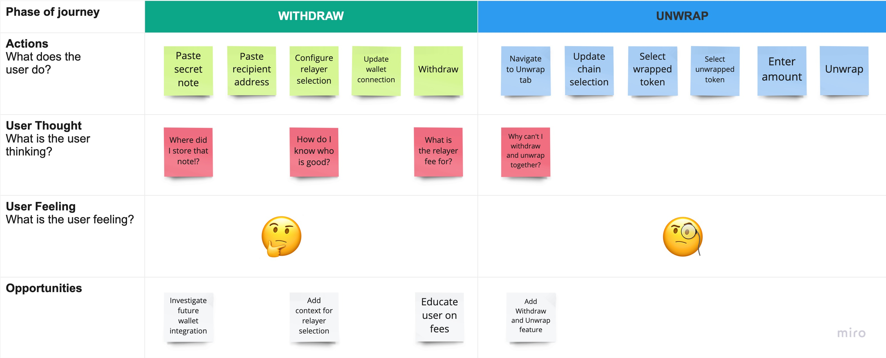

# Overview 

The following user journey maps illustrates the user flow for interacting with the current anchor protocol, starting with initial wallet selection, and continuing through the process of depositing and withdrawing wrapped assets.  

The user map aims to identify key interactions and touch-points with Webb's DApp and describes in detail the users intended goals, motivations, questions, and feelings at each step.

## Wrapped Deposits 🏦

The below user map represents **a DeFi user's intent to privately bridge their assets from chain A to chain B**. The initial steps required to achieve the desired result is to wrap the base origin asset into a Webb wrapped asset, create and store a secret note used to withdraw the assets on chain B, and then assets can be transferred privately across chains. 

### Key Takeaways 

- Future considerations for additional wallet support
- Easily switch between accounts within the DApp
- Redundant wallet connected chain and origin chain selection. They are required to be the same, thus only one really needs to be present
- Some consideration for educating users on Webb wrapped assets and their usage in this context
- Investigate updating flow to allow for origin chain selection --> destination chain selection --> token selection 
- Redundant deposit operation, user selects Deposit twice. (1) Upon **Deposit and Wrap**, and (2) upon note backup confirmation.

## Wrapped Withdrawals 💰

The below user map represents **a DeFi user's intent to privately withdraw their assets from specified destination chain**. The initial steps required to achieve the desired result is to retrieve the secret note generated on initial deposit, select a relayer to maintain privacy, and then proceed to unwrap the asset into the desired native asset. 

### Key Takeaways 

- Provide context to users on selecting a relayer for their transaction
- Educate users on fee structure 
- Add a **Withdraw and Unwrap** feature to remove the additional steps user must take to unwrap their assets

 
 
 

<h5 style="text-align:right">Last  Updated: 03-28-2022</h5>